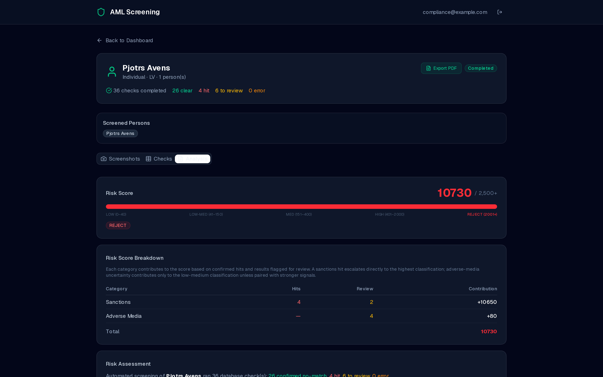
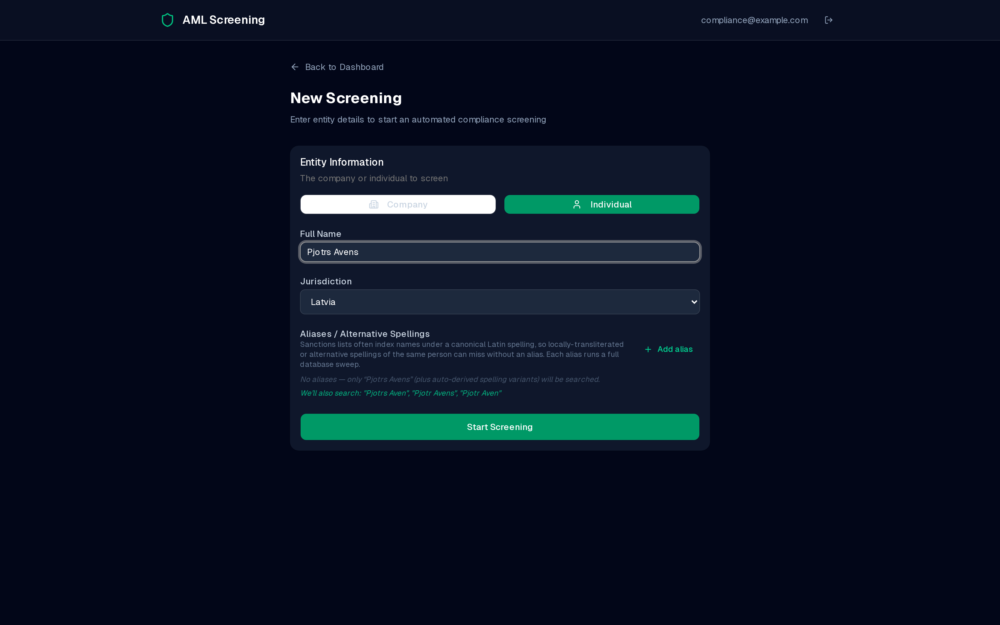
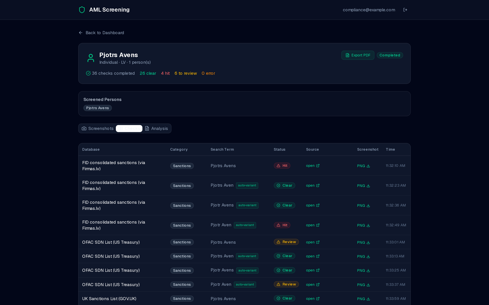
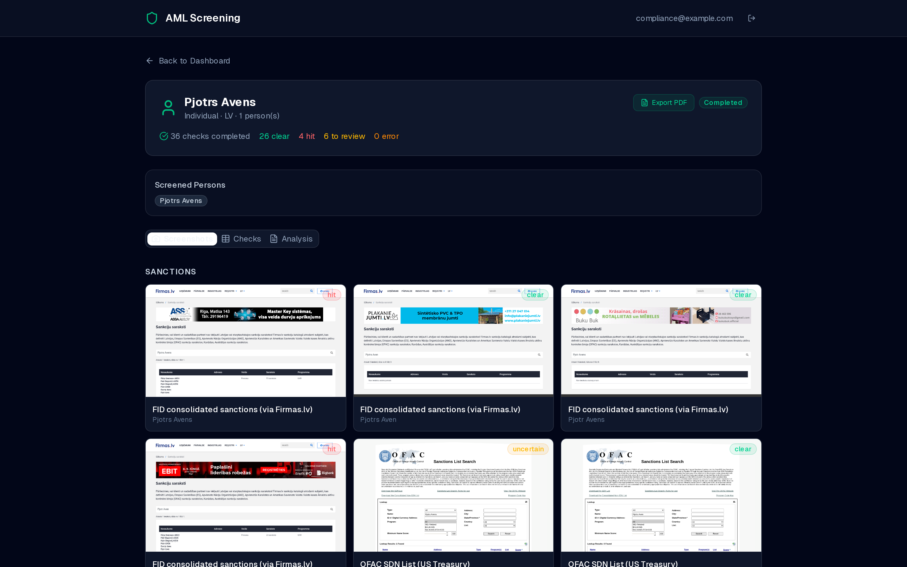
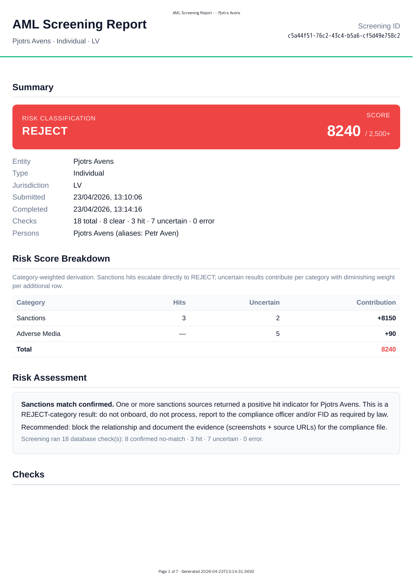

<div align="center">

# eu-aml-screening

**LV-deep AML/KYC screening with EU-consolidated sanctions.**
Open-source, self-hostable, audit-ready.

[](./LICENSE)
[](#coverage)
[](#maintenance-stance)
[](#architecture)

[Quick start](#quick-start) · [Coverage](#coverage) · [Scope](#scope) · [Roadmap](#roadmap) · [Self-host](#production-deployment)

</div>

---

<p align="center">
  
</p>

> [!NOTE]
> **What you get** — for every entity you screen:
> - A **timestamped evidence trail** (viewport screenshot + source URL per check)
> - A **category-weighted risk score** (LOW · LOW-MED · MEDIUM · HIGH · REJECT) with a transparent breakdown
> - An **auditable PDF bundle** plus pre-filled Latvian Bar Association annexes (P2 / P3.1 / P3.2) as PDF + DOCX

The engine refuses to default to "clean" — every `clear` verdict requires a positive no-results signal from the source page, every `hit` requires a positive match signal. Anything ambiguous is surfaced as `uncertain` for human review.

---

## Screens

<table>
  <tr>
    <td width="33%" align="center">
      <a href="./public/screenshots/01-form.png"></a>
      <br><sub><b>1. Submit</b> — auto-derives spelling variants from the name you enter</sub>
    </td>
    <td width="33%" align="center">
      <a href="./public/screenshots/02-progress.png"></a>
      <br><sub><b>2. Watch checks land</b> — per-source status, auto-variant badges, source links</sub>
    </td>
    <td width="33%" align="center">
      <a href="./public/screenshots/03-evidence.png"></a>
      <br><sub><b>3. Browse evidence</b> — every check carries the source-page screenshot</sub>
    </td>
  </tr>
</table>

The completed PDF that lands in the auditor's inbox:

<p align="center">
  <a href="./public/screenshots/05-pdf-page.png"></a>
</p>

---

## Coverage

| Source | Type | Jurisdiction | Notes |
|---|---|:---:|---|
| Firmas.lv Sankciju saraksts | Sanctions | 🇱🇻 🇪🇺 🇺🇸 🇬🇧 🇺🇳 🇦🇺 | FID consolidated — substring match on the Latvian summary line |
| OFAC SDN List | US Sanctions | 🇺🇸 | Regex on `Lookup Results: N Found` |
| UK Sanctions List | UK Sanctions | 🇬🇧 | Substring on `records found`. Companies use `downgradeCompanyHits` flag |
| VID PNP | Latvian PEP / tax debtors | 🇱🇻 | Persons-only |
| VID VAD | Latvian officials' declarations | 🇱🇻 | Persons-only |
| DuckDuckGo | Adverse media (LV / EN / ET / RU) | 🌐 | Persons-only; one source, 4 languages, requires `playwright-extra` stealth |
| Uzņēmumu reģistrs (UR) | Company registry | 🇱🇻 | 3 captures: Search → Detail → Persons (UBO at viewport 1800) |

**7 distinct sources**, fanned out across user-supplied aliases and LV-transliteration auto-variants (`expandLvVariants` — drops/adds trailing `s`/`š`). Each variant gets a full sweep across applicable sources. Persons-only sources skip company entities. The form preview shows the exact derived list before submission; the Checks tab labels every non-original variant with an `(auto-variant)` badge so reviewers can audit fan-out.

---

## What it does

```
You enter      → Pjotrs Avens, individual, jurisdiction LV
                 (the form auto-derives "Pjotr Avens" + "Pjotrs Avens" + …)
The engine     → screens each variant across:
                   · OFAC SDN List          (US sanctions)
                   · UK Sanctions List      (FCDO)
                   · FID consolidated       (LV/EU/UN/US/UK/AU via Firmas.lv)
                   · VID PNP / VID VAD      (Latvian PEP — persons only)
                   · DuckDuckGo (LV/EN/ET/RU adverse media — persons only)
                   · Uzņēmumu reģistrs      (LV company registry — companies only)
                 capturing a viewport screenshot + the source URL at each step
You receive    → live progress UI → completed evidence browser
                 → category-weighted risk score with breakdown
                 → audit PDF + DOCX/PDF annexes
```

The classifier (`src/lib/screening-engine.ts`) is the load-bearing piece: a five-rule precedence over each captured `pageText` that produces `clear | hit | uncertain | error`. The contract is documented at the top of that file — modifying the classifier without preserving its dual-affirmative invariant will silently regress. Run `npm run smoke:sanctioned` before merging changes there.

---

## Architecture

```
User → /screenings/new (form with live VariantPreview)
     → POST /api/screenings (creates row)
     → POST /api/screenings/[id]/run (spawns Playwright job, returns 202)
     → Playwright (sequential):
         · sanctions block (Firmas → OFAC → UK)
         · adverse-media block (DuckDuckGo, 4 languages, persons only)
         · UR block (3 screenshots, companies only)
       Screenshots → Supabase Storage; classifier writes per-check rows.
     → Frontend polls /api/screenings/[id]/status every 3s
       (synthetic `stalled` watchdog at 5min silence; /retry resets + re-runs)
     → /screenings/[id] renders:
        · Live progress step list
        · Screenshots tab (modal viewer + source URL)
        · Checks tab (results + auto-variant badges + per-row PNG download)
        · Analysis tab (risk score, breakdown, sources, annexes)
```

**Stack:** Next.js 16 (App Router) · React 19 · TypeScript · Tailwind v4 · shadcn/ui · Supabase (Postgres + Storage + OAuth) · Playwright (`playwright-extra` + `puppeteer-extra-plugin-stealth`) · Railway (Docker — Nixpacks doesn't include Chromium).

---

## Quick start

### Prerequisites

- Node.js 20+
- A Supabase project (free tier is fine for dev)
- Google OAuth credentials wired to your Supabase Auth → Providers config

### Setup

```bash
git clone https://github.com/SigvardsK/eu-aml-screening.git
cd eu-aml-screening
npm install

# Apply the Supabase schema (3 tables + RLS + storage bucket)
# Either run supabase/schema.sql + every supabase/migrations/*.sql against
# your project's SQL editor, or via the Supabase CLI:
#   supabase db push --linked

cp .env.local.example .env.local
# Fill in:
#   NEXT_PUBLIC_SUPABASE_URL=https://<your-project>.supabase.co
#   NEXT_PUBLIC_SUPABASE_ANON_KEY=...
#   SUPABASE_SERVICE_KEY=...   (server-side only; bypass RLS for engine writes)
#   SUPERUSER_EMAILS=          (optional — comma-separated list bypasses freemium gate)

npm run dev
# → http://localhost:3000
```

Sign in with Google, submit a screening, watch evidence land. Allow ~512MB of free RAM for Chromium.

### Verify the classifier (recommended)

After every change to `src/lib/screening-engine.ts` or `src/lib/db-configs.ts`, run the regression tripwire:

```bash
npx tsx scripts/smoke-test-sanctioned.ts
# Or:  npm run smoke:sanctioned
```

It exercises the contract that prevents the false-clear failure mode: known-sanctioned individuals (Petr Aven, Ramzan Kadyrov, Pjotrs Avens) **must not** return `clear` on any sanctions source.

---

## Production deployment

The repo ships a `Dockerfile` that builds the Next.js standalone output on top of `mcr.microsoft.com/playwright`, which is the simplest path to a working Chromium runtime. Railway, Fly.io, Render, and any Docker-capable host will take it as-is.

```bash
# Railway (one-line setup):
railway init
railway link
# Set env vars in the Railway dashboard:
#   NEXT_PUBLIC_SUPABASE_URL, NEXT_PUBLIC_SUPABASE_ANON_KEY, SUPABASE_SERVICE_KEY,
#   SUPERUSER_EMAILS (optional)
railway up
```

Notes:
- `NEXT_PUBLIC_*` env vars are inlined at build time via `next.config.ts`. Set them in the build environment, not just runtime.
- Headless-browser screening from datacenter IPs behaves differently from residential. Always probe each source from the deployed environment via `/api/test/check-database` before claiming a fix works.

---

## Scope

This is what the project covers today, in plain language.

- **Production-ready for Latvia.** Individual + company screening for LV-jurisdiction subjects. The form currently accepts LV only.
- **EU-consolidated sanctions cover all jurisdictions.** Even when you're screening an LV-resident individual, OFAC, UK, EU, UN, AU, and FID consolidated lists are all checked. A sanctioned person hiding in any of those lists will surface.
- **Latvian-specific PEP, registry, and adverse-media** sources (VID PNP, VID VAD, Uzņēmumu reģistrs, LV-language adverse media) are first-class.
- **Adverse media in 4 languages** (LV / EN / ET / RU) is run for every individual regardless of jurisdiction.
- **Outputs map to the Latvian Bar Association compliance schema** (Instrukcija NILLTPFN-SL) — annexes P2, P3.1, P3.2 are generated as PDF + DOCX, ready for lawyer sign-off.

What's **not** covered today: jurisdiction-specific PEP / registry / official-declaration data for EE and LT. Those are roadmap items, not yet integrated. If you need them now, see [Contributing](#contributing).

---

## Limitations

- **Single-user concurrency.** The engine runs database checks sequentially to avoid rate limiting; concurrent screenings sharing one Chromium instance need additional isolation (not implemented).
- **No rate limiting / payment gating in this build.** This is the open-source self-host build. Public-facing deployments need their own rate limiter, abuse-reporting endpoint, and (if commercial) payment integration.
- **Headless-browser bot-detection caveats.** Lursoft (Cloudflare Turnstile) and Namescan (JA3 fingerprinting) are excluded. Google web search is blocked from datacenter IPs even with stealth — DuckDuckGo is the adverse-media source.
- **Chromium memory.** Railway / similar containers need ≥512MB RAM. The engine recycles pages between major sections to release per-page heap.
- **No production support.** See the maintenance stance below.

---

## Roadmap

Tracked as [GitHub Issues](https://github.com/SigvardsK/eu-aml-screening/issues). No timelines — community PRs welcome.

- 🇪🇪 **Estonia coverage** — e-äriregister (registry) + EE PEP / officials' declarations source
- 🇱🇹 **Lithuania coverage** — equivalent registry + PEP sources
- **Jurisdiction-aware adverse-media language selection** — currently runs LV/EN/ET/RU for every variant; should pick languages from jurisdiction context
- **Manual-review workflow** — UI for analysts to mark `uncertain` checks as cleared / confirmed with annotation
- **Non-LV annex schemas** — currently only the Latvian Bar Association annex set is generated
- **Wider jurisdiction dropdown** — gated on the source integrations above shipping first

A hosted (managed) version is in productization — until it ships, self-host or [open an issue](https://github.com/SigvardsK/eu-aml-screening/issues/new) to be notified.

---

## Contributing

Issues and PRs welcome. No SLA, reviewed weekly best-effort. Before opening a PR, read [`AGENTS.md`](./AGENTS.md) — it documents the load-bearing files, the dual-affirmative classifier invariant, and the regression tripwire (`npm run smoke:sanctioned`) that must pass before changes to `src/lib/screening-engine.ts`, `src/lib/db-configs.ts`, or `src/lib/risk-score.ts` are merged.

---

## Maintenance stance

Open-source maintained on a best-effort basis through **2026-07-31**. Issues reviewed weekly. PRs welcome — no SLA. After 2026-07-31, status will be re-evaluated based on community signal.

For production deployments or compliance consulting, see [sigvards.krongorns.com](https://sigvards.krongorns.com).

---

## License

AGPL-3.0-or-later. See [`LICENSE`](./LICENSE) for the full text. **Hosted SaaS providers must publish modifications** — this is the load-bearing clause that distinguishes AGPL from GPL. If you're forking to run a commercial hosted offering, you must make your fork's source available to your users.

Copyright (C) 2026 Sigvards Krongorns.
